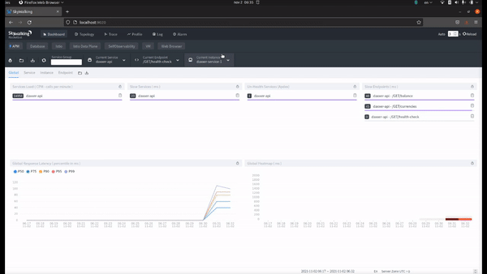

```
             ./########/            ..,,,,..           .(########(.             
               ./########*     ,/(#############(,    ./########/.               
                 ./#######(* *###################(. *########/.                 
                    /##############(,..  ..,/###, ,(#######/.                   
                      *(#########(.          .*. (#######/.                     
                       /########.             ./#########                       
                     ,(#######* ,#*          *############*                     
                   ,########/..(#####/**,*/(#######(########*                   
                 *(#######(. ./##################(,  *(#######*.                
               *#########,      .*/(#########(*,      ./########/.              
             .,,,,,,,,,,                                .,,,,,,,,,.    

@Daxxer - Golang Challenge
```

System responsible for managing funds and assets of a digital account. 
It is possible to create an account, deposit, withdraw, view the history given a date and also view the prices of currencies supported by the system.

## Currency prices update

To update the prices of the currencies there are two implementations to choose from. 
[CoinGecko API](https://www.coingecko.com/en/api) or [CoinBase API](https://developers.coinbase.com/api/v2).

## Requirement (run in Docker)

You must have installed [Docker](https://www.docker.com/).

```bash
# Given the repository
# Access the project folder
$ cd daxxer-api

# Run the script build the app's docker image, download dependencies
$ ./scripts/build.sh

# Run the application 
$ ./scripts/run.sh
```

## API 

### Account endpoints
<details open>
<summary>Create</summary>

```bash
# To create a account/user
$ curl --location --request POST 'http://localhost:8000/create' \
--header 'Content-Type: application/json' \
--data-raw '{
    "user" : "jose"
}'
```
</details>

<details>
<summary>Deposit</summary>

```bash
# To deposit into account
curl --location --request POST 'http://localhost:8000/deposit' \
--header 'Content-Type: application/json' \
--data-raw '{
    "user" : "jose",
    "amount" : {
        "id": "bitcoin",
        "currency": "btc",
        "value": 0.4
    }
}'
```
</details>

<details>
<summary>Withdraw</summary>

```bash
# To withdraw from account
curl --location --request POST 'http://localhost:8000/withdraw' \
--header 'Content-Type: application/json' \
--data-raw '{
    "user" : "jose",
    "amount" : {
        "id": "bitcoin",
        "currency": "btc",
        "value": 0.1
    }
}'
```
</details>

<details>
<summary>Balances</summary>

```bash
# To balances from account
curl --location --request GET 'http://localhost:8000/balance?user=jose'
```
</details>

<details>
<summary>History</summary>

```bash
curl --location --request GET 'http://localhost:8000/history?user=jose&startDate=2021-10-30&endDate=2021-10-31&page=0&limit=101'
```
</details>

<details>
<summary>Prices</summary>

```bash
curl --location --request GET 'http://localhost:8000/prices'
```
</details>

### Currency endpoints
<details>
<summary>Create</summary>

```bash
# To create a currency
curl --location --request POST 'http://localhost:8000/currency' \
--header 'Content-Type: application/json' \
--data-raw '{
    "id" : "usd",
    "name" : "dollar"
}'
```
</details>

<details>
<summary>Get all</summary>

```bash
# To get all currencies
curl --location --request GET 'http://localhost:8000/currencies'
```
</details>

<details>
<summary>Delete by id</summary>

```bash
# To delete currency by id
curl --location --request DELETE 'http://localhost:8000/currency?id=etd'
```
</details>

### Crypto Currency endpoints
<details>
<summary>Create</summary>

```bash
# To create a crypto currency
curl --location --request POST 'http://localhost:8000/crypto-currency' \
--header 'Content-Type: application/json' \
--data-raw '{
    "symbol" : "btc",
    "id" : "bitcoin"
}'
```
</details>

<details>
<summary>Get all</summary>

```bash
# To get all crypto currencies
curl --location --request GET 'http://localhost:8000/crypto-currencies'
```
</details>

<details>
<summary>Delete by id</summary>

```bash
# To delete crypto currency by id
curl --location --request DELETE 'http://localhost:8000/crypto-currency?id=etd'
```
</details>

# Developer
## Requirements (run localhost)
To running to this project you must have basically installed [Go](https://golang.org)

## Downloading dependencies
```bash
# Run mod
$ go mod download
```

## Testes
You can run the tests with script below
```bash
# Run tests
$ ./scripts/tests.sh
```

## Implementation

### DBConfig Interface
The current version implements ```NewMongoConfig``` responsible for abstracting the mongodb integration

If it is necessary to change the origin of the data, the ```DBConfig``` interface must be implemented

```go
// Example
func NewPostgreSqlConfig() database.DBConfig {
    return &postgreConfig{}
}
...
```

### Router Interface
The current version uses ```NewGinRouter``` responsible for handler the routes and serve
There is other implementation ```NewMuxRouter``` just for tests

If it is necessary to change the framework to handler and serve routes, the ```Route``` interface must be implemented

```go
// Example
func NewBuffaloRouter() routers.Router {
    return &buffaloRouter{}
}
...
```

### ApiRepository Interface
The current version implements ```NewCoinGeckoApiRepo``` responsible for get currencies prices
There is other implementation ```NewCoinBaseApiRepo``` just for tests

If it is necessary to change the prices api, the ```ApiRepository``` interface must be implemented
```go
// Example
func NewCoinMarketApiRepo(client HttpClient) ApiRepository {
    return &coinMarketRepo{
        Url: os.Getenv("API_ENDPOINT"),
        Client: client,
    }
}
...
```

## Metrics
### Apache SkyWalking
[SkyWalking](https://github.com/apache/skywalking) is an open source APM(Application Performance Monitor) system.  
At first this project(daxxer-api) is using the tool(SkyWalking) to collect some metrics, measure latency with external service, endpoint tracing.  
When the application is running(by the ./scripts/run.sh) the service can be access http://localhost:9020

